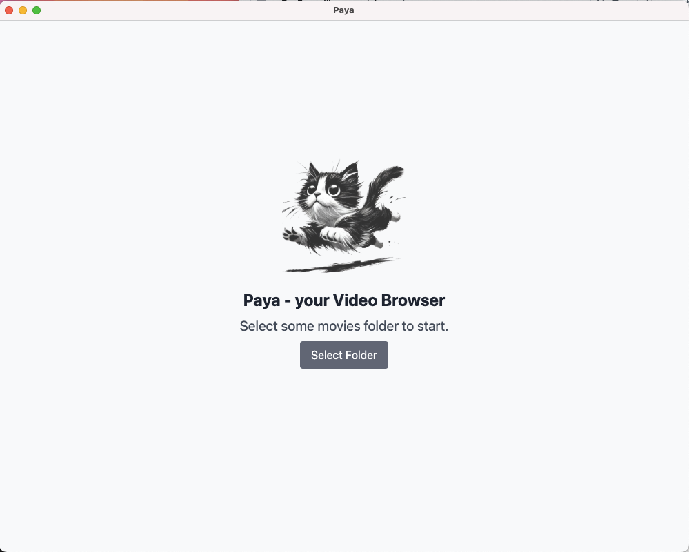

# PAYA (Video Browser in Electron)

A cross-platform desktop application built with Electron that allows users to watch video files in a specified folder.



## Installation

### Prerequisites
- Node.js v18+
- npm v9+

### Quick Start
```bash
# Clone repository
git clone https://github.com/guilhermesalviano/paya.git

# Install dependencies
cd video-folder-manager
npm install

# Start development mode
npm run dev

# Build application
npm run build
```

## Ideas

- 📂 **Folder Selection**
  - Choose any directory from your file system
  - Persistent storage of selected folder path
  - Automatic video file detection (MP4, MOV, AVI, MKV, etc.)

- 🎥 **Video Management**
  - Thumbnail previews for quick visual identification
  - File metadata display (duration, resolution, size)
  - Basic video operations:
    - Play in built-in viewer
    - Rename files
    - Delete files
    - Move to subfolders

- ⚙️ **Custom Processing**
  - Batch conversion to different formats
  - Resolution scaling options
  - Basic video editing tools:
    - Trim/crop videos
    - Adjust playback speed
    - Extract audio

- 🔄 **Automation**
  - Auto-organization by date/resolution
  - Duplicate file detection
  - Custom folder structure templates